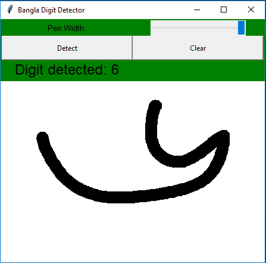

# Bangla_digit_detection
Using convolutional neural network
Tools Used: jupyter notebook, Anaconda(for creating virtual enviroment), spyder, tkinter, Android(not completed yet), keras-2.24.0, tensorflow-1.13.1

System used: intel core i7-4790k
	     Ram: 16GB
	     Gpu: Nvidia Quadro GV100

# Dataset:
Dataset used: NumtaDB (training-a) Link: https://www.kaggle.com/BengaliAI/numta

# Images:

# Credits:
https://github.com/JohnnyKaime/animal-image-classifications

